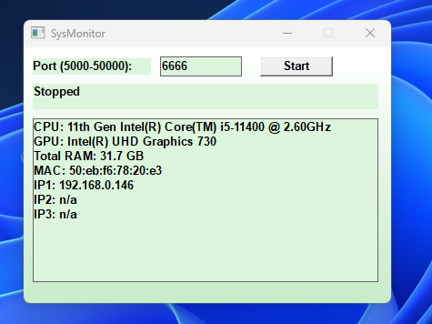

# SysMonitor (Win32)

一個輕量級的 Windows 系統監控工具，無需安裝龐大的 Runtime。它顯示 CPU、GPU、RAM 與網路資訊，並提供 TCP Server 功能，讓外部設備（如 Mac/Linux）可以遠端獲取監控數據。

## Screenshot



## 功能 (Features)

*   **系統資訊**：顯示 CPU 型號、GPU 型號、記憶體 (RAM) 總量。
*   **網路監控**：自動偵測並顯示最多三張網卡 (IP1, IP2, IP3) 的 IP 位址與 MAC 位址，每 15 秒自動刷新。
*   **TCP Server**：
    *   預設 Port: **6666**
    *   支援外部客戶端 (如 `netcat`) 連線獲取即時數據。
    *   資源佔用極低 (CPU 0%, RAM < 10MB)。
    *   安全設計：單執行緒，同時只服務一個客戶端。

## 使用方式 (Usage)

1.  在 Windows 上執行 `SysMonitor.exe`。
2.  點擊 **Start** 按鈕啟動服務（狀態顯示為 Listen on port 6666）。
3.  在 Mac/Linux/其他電腦的終端機輸入：
    ```bash
    nc <Windows_IP> 6666
    ```
    *(Windows IP 可直接在程式介面上的 IP1 / IP2 / IP3 欄位查看)*
4.  即可每秒收到一次系統狀態更新。

## 建置 (Build)

*   **IDE**: Visual Studio 2022
*   **語言**: C++ (Windows API)
*   **相依性**: Windows SDK 
    *   Winsock2 (`ws2_32.lib`)
    *   IP Helper API (`iphlpapi.lib`)
    *   *註：已在程式碼中透過 `#pragma comment` 自動連結，無需手動設定 linker。*

## 授權 (License)

MIT License
