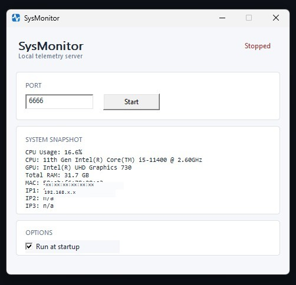

# SysMonitor

SysMonitor is a lightweight native Windows monitoring tool that shows CPU, GPU, memory, and network information locally, and can also start a built-in TCP server so phones, Macs, Linux machines, or other computers can read this Windows PC's monitoring data in real time.  
SysMonitor 是一個輕量級的 Windows 原生監控工具，可以在本機顯示 CPU、GPU、記憶體與網路資訊，也可以開啟內建 TCP Server，讓手機、Mac、Linux 或其他電腦即時讀取這台 Windows 電腦的監控資料。



## Key Features
主要功能

- Shows the CPU model, total CPU usage, GPU model, memory information, and network information.  
  顯示 CPU 型號、總使用率、GPU 型號、記憶體與網路資訊。
- Estimates the FPS of the current foreground window through ETW.  
  透過 ETW 估算目前前景視窗的 FPS。
- Includes a built-in TCP server that pushes UTF-8 JSON Lines data once per second.  
  內建 TCP Server，以 UTF-8 JSON Lines 格式每秒推送一次資料。
- Uses port `6666` by default, and the port can be changed in the UI.  
  預設 Port 為 `6666`，可以在 UI 中修改。
- Supports background operation: minimizing or closing the window sends it to the system tray.  
  支援背景常駐：最小化或關閉視窗後會縮到系統工具列。
- Supports launch at startup, then stays in the system tray as a small utility.  
  支援開機自動啟動，啟動後會以小工具形式常駐在工具列。
- Built with native Win32 C++, without Electron or a browser runtime.  
  使用 Windows 原生 Win32 C++ 製作，不使用 Electron 或瀏覽器 runtime。

## Download and Install
下載與安裝

1. Download the latest `SysMonitor_Setup_*.exe` from GitHub Releases.  
   到 GitHub Releases 下載最新版的 `SysMonitor_Setup_*.exe`。
2. Run the installer and follow the on-screen steps.  
   執行安裝檔並依照畫面完成安裝。
3. On first launch, Windows may show a UAC permission prompt because FPS monitoring uses ETW, and startup launch creates a Windows scheduled task.  
   第一次啟動時 Windows 可能會跳出 UAC 權限確認，這是因為 FPS 監控使用 ETW，且開機自動啟動會建立 Windows 工作排程。
4. After installation, you can launch SysMonitor from the Start menu, or uninstall it from Windows Installed apps.  
   安裝後可以從開始功能表啟動 SysMonitor，也可以在 Windows「已安裝的應用程式」中解除安裝。

## Verify Downloads
驗證下載檔

Each GitHub Release includes `SHA256SUMS.txt` and `BUILD_INFO.txt`. `BUILD_INFO.txt` records the GitHub Actions run and commit that produced the installer; `SHA256SUMS.txt` can be used to confirm that the installer you downloaded matches the file produced by GitHub Actions.  
GitHub Release 會附上 `SHA256SUMS.txt` 與 `BUILD_INFO.txt`。`BUILD_INFO.txt` 會記錄產生該安裝檔的 GitHub Actions run 與 commit；`SHA256SUMS.txt` 可以用來確認你下載到的安裝檔和 GitHub Actions 產出的檔案一致。

Check it in PowerShell with:  
在 PowerShell 中可以這樣檢查：

```powershell
Get-FileHash .\SysMonitor_Setup_1.0.1.exe -Algorithm SHA256
```

Compare the output SHA256 value with `SHA256SUMS.txt` in the Release.  
把輸出的 SHA256 值和 Release 裡的 `SHA256SUMS.txt` 對照即可。

The installer is not currently signed with an official code signing certificate. Windows Smart App Control or Microsoft Defender SmartScreen may still show warnings or block newly downloaded unsigned installers; open source code and SHA256 checks help verify the file source, but they do not replace Windows code signing trust.  
目前安裝檔尚未使用正式 code signing certificate 簽章。Windows Smart App Control 或 Microsoft Defender SmartScreen 仍可能對新下載、未簽章的安裝檔顯示警告或封鎖；開源和 SHA256 可以協助確認檔案來源，但不能取代 Windows 的程式碼簽章信任。

## Basic Usage
基本使用

After opening the app, the window shows the current system status. Press **Start** to start the TCP server, and the status will show `Listening on port 6666`; press **Stop** to stop the server.  
開啟程式後，視窗會顯示目前系統狀態。按下 **Start** 會啟動 TCP Server，狀態會顯示 `Listening on port 6666`；按下 **Stop** 則會停止 Server。

When **Run at startup** is checked, SysMonitor automatically starts when you sign in to Windows and minimizes to the system tray. Uncheck it to disable startup launch.  
勾選 **Run at startup** 後，SysMonitor 會在登入 Windows 時自動啟動並縮到系統工具列。取消勾選即可停用開機自動啟動。

When you minimize the window or close it with the top-right close button, the app does not exit directly; it keeps running in the background from the system tray. To fully close it, right-click the tray icon and choose **Stop SysMonitor**.  
最小化或按右上角關閉視窗時，程式不會直接結束，而是縮到系統工具列背景執行。若要完全關閉程式，請在工具列圖示上按右鍵，選擇 **Stop SysMonitor**。

## Read Data from Another Device
從其他裝置讀取資料

SysMonitor's TCP server actively pushes data. After a client connects, it does not need to send any command; it only needs to keep reading.  
SysMonitor 的 TCP Server 是主動推送模式。Client 連線後不需要送任何指令，只要持續讀取即可。

On macOS or Linux, use:  
在 macOS 或 Linux 上可以使用：

```bash
nc <Windows_IP> 6666
```

On Windows PowerShell, use:  
在 Windows PowerShell 上可以使用：

```powershell
$client = New-Object System.Net.Sockets.TcpClient("<Windows_IP>", 6666)
$stream = $client.GetStream()
$reader = New-Object System.IO.StreamReader($stream, [Text.Encoding]::UTF8)
while ($true) {
  $line = $reader.ReadLine()
  if ($null -eq $line) { break }
  $line
}
```

If another device cannot connect, check that:  
如果其他裝置連不上，請確認：

- **Start** has been pressed in SysMonitor.  
  SysMonitor 已按下 **Start**。
- The client is using the correct Windows IP address and port.  
  Client 使用的是正確的 Windows IP 與 Port。
- Windows Firewall allows inbound connections for SysMonitor or the selected port.  
  Windows 防火牆允許 SysMonitor 或該 Port 的入站連線。
- Both devices are on a network where they can reach each other.  
  兩台裝置在可互通的網路環境中。

## Output Data
傳出資料

Each line is a complete JSON object containing:  
每一行都是一個完整 JSON object，內容包含：

- `cpu`: CPU model, total CPU usage, and per-core usage.  
  `cpu`：CPU 型號、總使用率、每核心使用率。
- `gpu`: GPU model and Dedicated/Shared memory information.  
  `gpu`：GPU 型號、Dedicated/Shared 記憶體資訊。
- `memory`: Total physical memory, available memory, used memory, and usage percentage.  
  `memory`：實體記憶體總量、可用量、使用量與使用率。
- `network`: MAC address and IP list.  
  `network`：MAC address 與 IP 清單。
- `fps`: Current foreground window PID, window title, and estimated FPS.  
  `fps`：目前前景視窗 PID、視窗標題與 FPS 估算值。

Simplified example:  
簡化範例：

```json
{
  "cpu": { "name": "Intel(R) ...", "usage_total_percent": 12.3 },
  "gpu": { "name": "NVIDIA ...", "dedicated_bytes": 123456789 },
  "memory": { "used_phys_percent": 37.5 },
  "network": { "mac": "aa:bb:cc:dd:ee:ff", "ips": ["192.168.0.146"] },
  "fps": { "ok": true, "pid": 12345, "window_title": "MyGame", "value": 144.2 }
}
```

Only one client is served at a time. To read from another device, disconnect the existing client first.  
目前同時間只服務一個 client；若需要換裝置讀取，請先中斷原本的連線。

## Privacy and Security
隱私與安全提醒

After the TCP server is started, any device that can reach the selected port on this Windows PC can read the monitoring data. The data may include the MAC address, local network IP address, foreground window title, and hardware information.  
啟動 TCP Server 後，只要能連到這台 Windows 電腦指定 Port 的裝置，就可以讀取監控資料。資料中可能包含 MAC address、內網 IP、前景視窗標題與硬體資訊。

Use it only on trusted home or private networks. Avoid enabling the server on public Wi-Fi, company guest networks, or other untrusted environments.  
建議只在可信任的家用或私人網路中使用，不建議在公共 Wi-Fi、公司訪客網路或不受信任的環境中開啟 Server。

## Build from Source
自行編譯

Visual Studio 2022 or Visual Studio Build Tools is required, with MSBuild, the MSVC C++ toolchain, and the Windows SDK installed.  
需要 Visual Studio 2022 或 Visual Studio Build Tools，並安裝 MSBuild、MSVC C++ 工具鏈與 Windows SDK。

Run these commands from the project root:  
在專案根目錄執行：

```batch
build_debug.bat    REM Build Debug x64 / 編譯 Debug x64
build_release.bat  REM Build Release x64 / 編譯 Release x64
run.bat            REM Run Debug build / 執行 Debug 版
run.bat release    REM Run Release build / 執行 Release 版
```

## License
授權

SysMonitor is released under the MIT License. The app icon is based on the Lucide Icons `activity` icon; see `assets/THIRD_PARTY_NOTICES.txt` for license details.  
SysMonitor 採用 MIT License。應用程式圖示基於 Lucide Icons 的 `activity` icon 製作，授權資訊請見 `assets/THIRD_PARTY_NOTICES.txt`。
